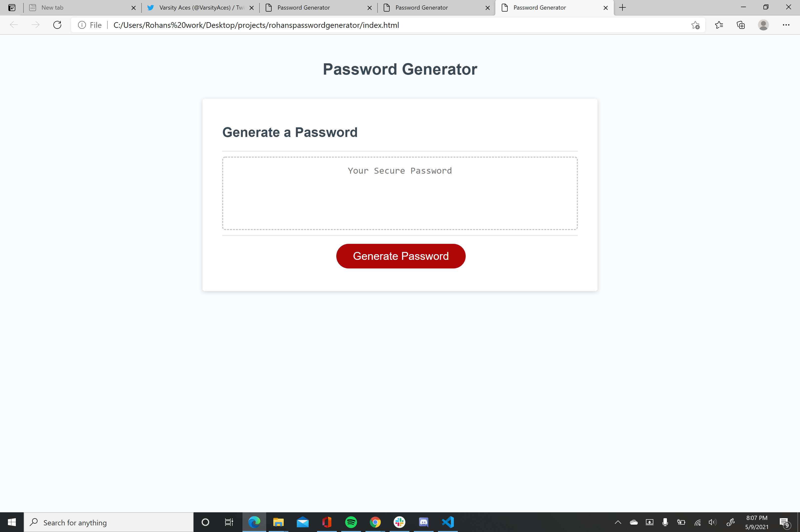
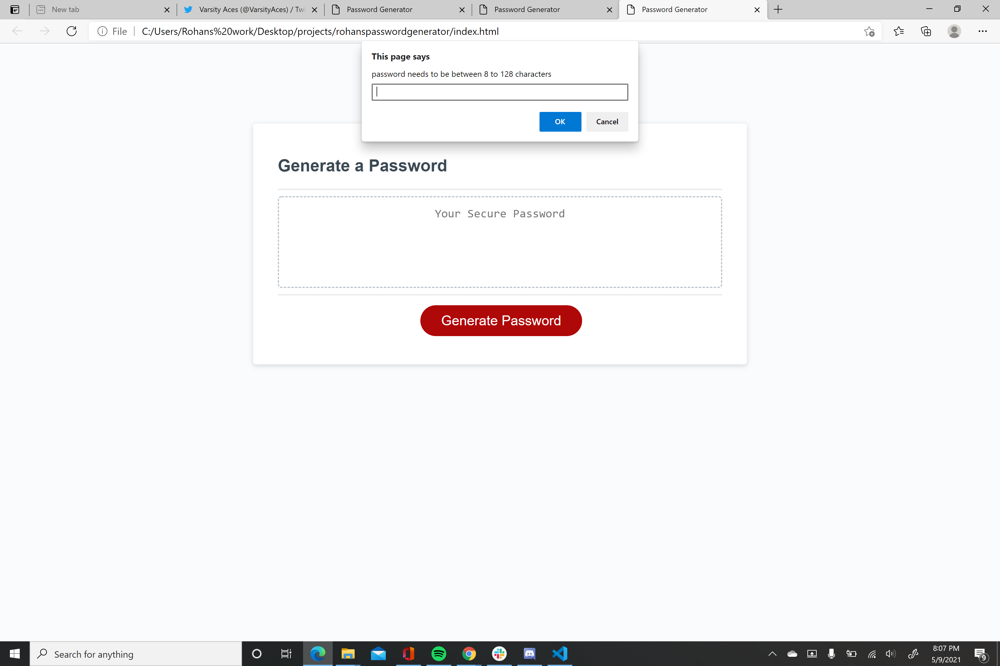
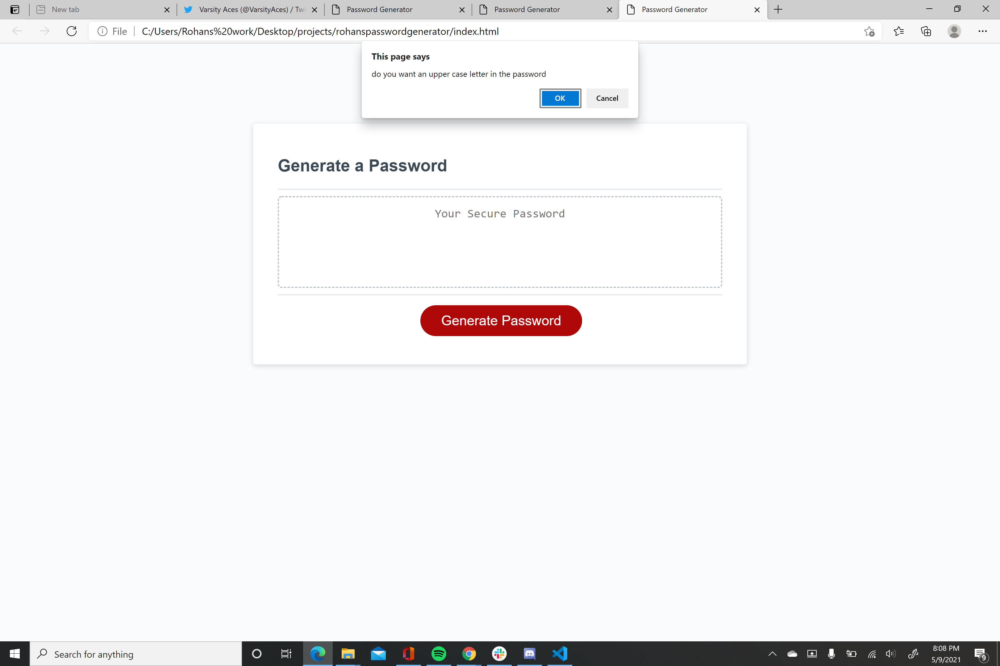
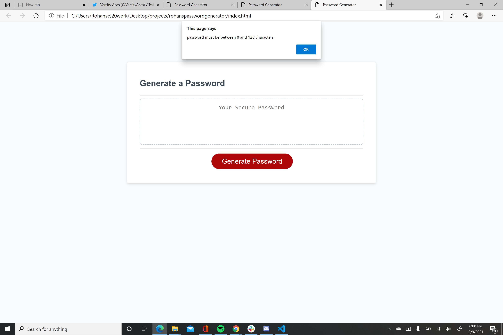

# rohanspasswordgenerator
We were given starter code to generate a password. While I was able to have prompts appear that allowed me to imput the number of characters that I could use on my project, I could not get the generate password prompt to appear. I made various arrays of all the character options that would be available for the password.
Also attached are screenshots of the prompts that functioned.

